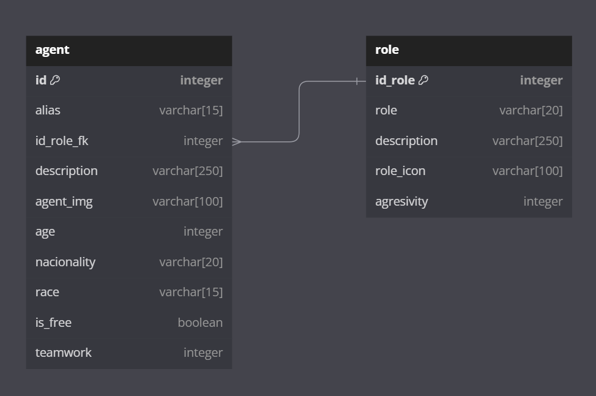

# Trabajo Práctico Especial - Web 2 
El repositorio corresponde a un proyecto realizado para la materia de Web 2 de la Tecnicatura en Desarrollo de Aplicaciones Informáticas de la Facultad de Exactas de UNICEN. 

## Integrantes:
 - Andreozzi Fiamma Belén (fbelen.andreozzi@gmail.com)
 - Vytas Tuckus Carolina (00caro2002@gmail.com)

## Temática: Agentes de Valorant
El proyecto será un visualizador de agentes del juego de Riot  Games, Valorant. 
A cada agente le corresponde un único rol mientras varios agentes pueden pertenecen al mismo. 
## Diagrama de Entidad-Relación:

